<div align="center">

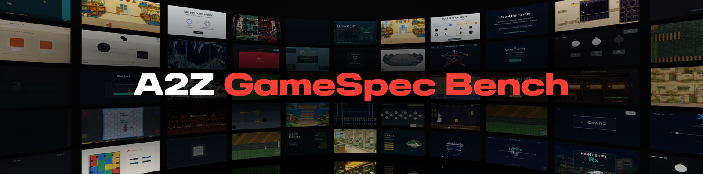

### How Faithfully Can Coding Agents Generate Games from Game Design Specifications?

[](https://arxiv.org/abs/2609.39564)
[](https://a2z-gamespec-bench.github.io)
[](#news)
[](LICENSE)

[Seonho Lee](https://glanceyes.github.io)<sup>1\*</sup>, [Wonryeol Jeong](https://github.com/jwr0218)<sup>1\*</sup>, [Alberto Cereser](https://github.com/albusdemens)<sup>1</sup>, [Inha Kang](https://2na-97.github.io/)<sup>1,2</sup>, [Hyeonjong Kim](https://github.com/hjkim001)<sup>1</sup>, [Seungmin Kwak](https://github.com/Kwak-Seungmin)<sup>1,3</sup>, [Dongmin Park](https://dongmean.github.io)<sup>1</sup>

<sup>1</sup> KRAFTON &nbsp;·&nbsp; <sup>2</sup> KAIST &nbsp;·&nbsp; <sup>3</sup> Korea National University of Arts

</div>

---

<div align="center">


</div>

<br/>

> **TL;DR.** A2Z GameSpec-Bench measures how faithfully coding agents turn **long-form game design documents (GDDs)** into playable games. Each of its **100 GDDs** (50 *Small*, 50 *Big*) is compiled into a fixed **Dependency-Aware Contract**. Every build is evaluated against the same contract through not only **source-code inspection** but also **Test Policies**, including **scenario-based replay**, and **adaptive playtesting**, with requirement-level feedback to guide revision.

<br/>

<div align="center">

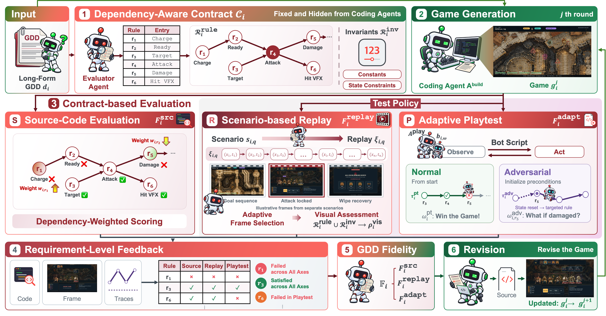

</div>

<br/>
<details>
<summary><b>📄 Abstract</b></summary>
<br/>
Delegating complete application development to coding agents requires preserving the intended design rather than simply producing plausible outputs through naïve prompting. Game development provides a demanding testbed, as long-form Game Design Documents (GDDs) describe requirements that must work together across game logic, visual rendering, and player interactions. However, existing game-development benchmarks typically use compact specifications and provide limited support for evaluating interdependent requirements across these aspects in long-form GDDs. We introduce <b>A2Z GameSpec-Bench</b>, a benchmark of 100 long-form GDDs for evaluating end-to-end game development by agents. We measure <i>faithfulness</i> by checking whether the game satisfies the GDD requirements and preserves the relationships among them. Each GDD is turned into a Dependency-Aware Contract that contains rules, constraints, and prerequisite relations. Following game-development practices, we combine source-code inspection with agent-generated Test Policies for scenario-based replay and adaptive playtesting. The contract remains fixed across agents and revision rounds, while judgments and evidence linked to the same requirements support consistent comparison and failure detection. Our evaluations show that current agents struggle to jointly satisfy interdependent requirements across code implementation and actual play. Requirement-specific feedback improves GDD Fidelity by 10.9% relative gain over self-revision after two rounds. A2Z GameSpec-Bench assesses end-to-end specification-following ability beyond implementation judgments and provides targeted feedback to support more faithful game development.
</details>

## News

- Code and dataset will be available soon.
- Our [paper preprint](https://arxiv.org/abs/2609.39564) is available on arXiv.


## Benchmark Overview

- **Dependency-Aware Contract.** Each GDD is compiled into rules, invariants, and prerequisite relations. The evaluation contract is withheld during initial game generation and remains fixed across agents and revision rounds.
- **Test Policies.** Agent-generated policies turn requirements into executable tests: fixed input sequences for canonical scenarios, and adaptive bots that explore the game and test rules that remain unverified.
- **Three Evaluation Axes.** Source-code inspection, scenario-based replay, and adaptive playtesting assess the same requirements through code, rendered output, and runtime behavior. Their arithmetic mean is **GDD Fidelity**.

<div align="center">

| | *Small* (50 GDDs) | *Big* (50 GDDs) |
|:---:|:---:|:---:|
| Tokens per GDD (mean) | 14,085 | 26,297 |
| Outcome requirements per GDD (mean) | 54.2 | 84.0 |
| Design scope | one core mechanic, one screen | interacting systems: campaigns, economies, narrative |

</div>

### The 100 GDDs

Each GDD is developed from a short brief and a creative vision, then checked for structural conformance, internal consistency, behavioral soundness, and numerical correctness before inclusion. The 50 *Small* GDDs cover eight task families, while the 50 *Big* GDDs cover eleven game genres.

<div align="center">

| *Small* task family | n | | *Big* genre | n |
|:---:|:---:|:---:|:---:|:---:|
| Reaction, Inhibition & Speed Classification | 9 | | Simulation & Management | 8 |
| Continuous & Precision Motor Control | 9 | | Platformer & Metroidvania | 7 |
| Temporal Precision & Rhythm | 7 | | Adventure & Narrative | 6 |
| Planning & Sequential Decision | 7 | | Strategy & Tactics | 5 |
| Deduction & Constraint Solving | 6 | | Action Roguelite & Survival | 4 |
| Spatial Reasoning & Mental Transformation | 5 | | Rhythm | 4 |
| Perceptual Estimation & Psychophysics | 4 | | Puzzle | 4 |
| Short-Term Memory & Attentional Tracking | 3 | | RPG | 4 |
| | | | Shooter & Bullet-hell | 3 |
| | | | Sports & Racing | 3 |
| | | | Idle & Clicker | 2 |

</div>

<div align="center">
<table>
<tr>
<td align="center" rowspan="2"><b><i>Big</i></b></td>
<td align="center">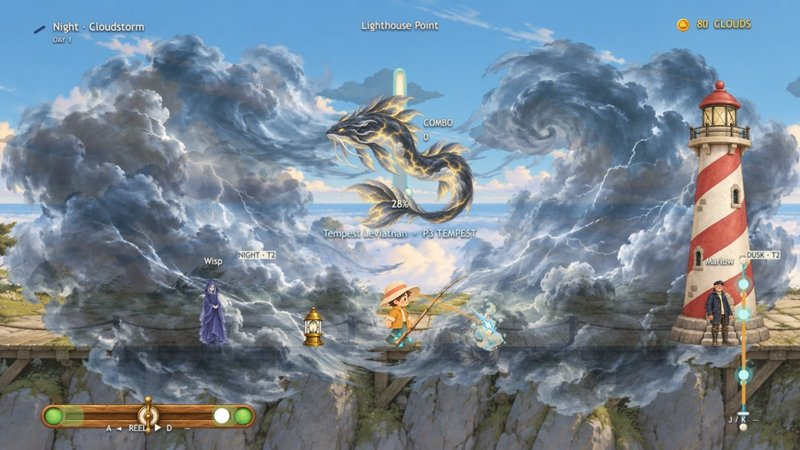<br><sub>Cloud Cast</sub></td>
<td align="center">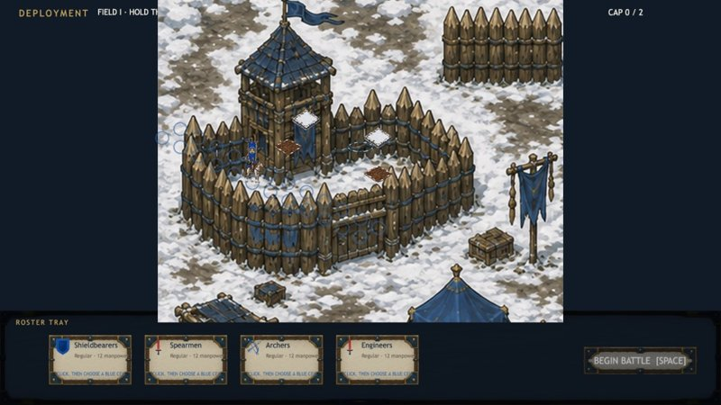<br><sub>Siege Deck 2D</sub></td>
<td align="center">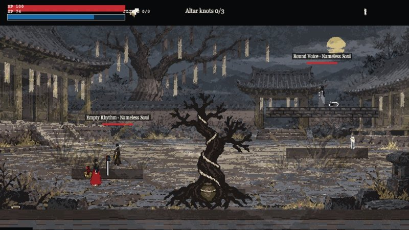<br><sub>Ssitgim</sub></td>
<td align="center">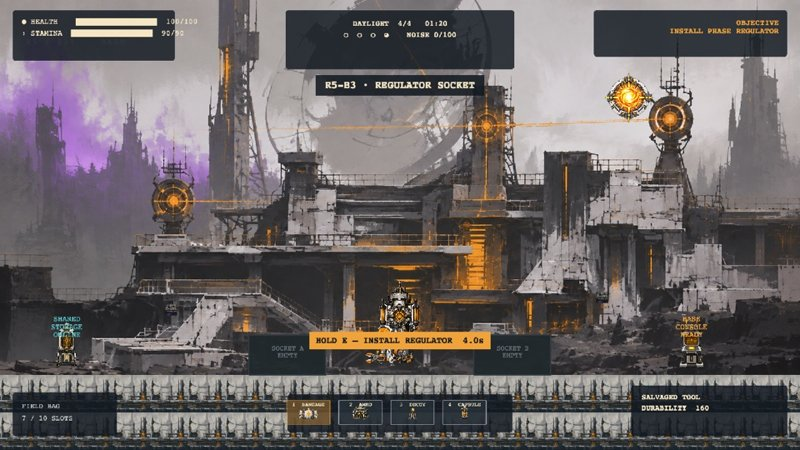<br><sub>Afterglow Network</sub></td>
</tr>
<tr>
<td align="center">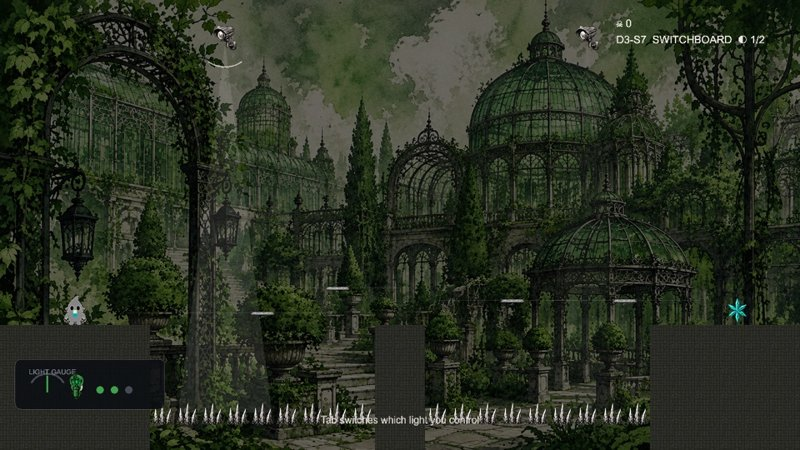<br><sub>ChromaShade</sub></td>
<td align="center">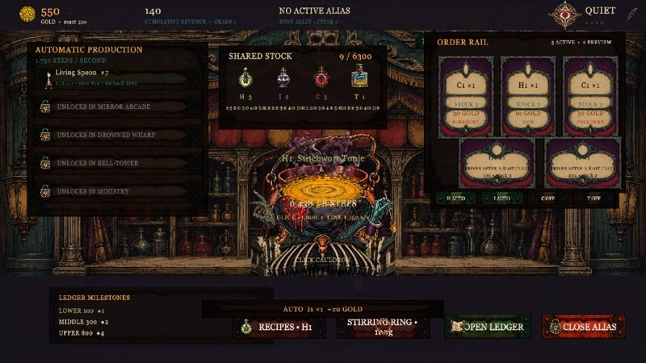<br><sub>Alias Alchemy Shop</sub></td>
<td align="center">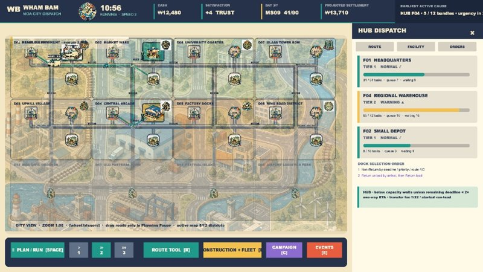<br><sub>Wham Bam Logistics</sub></td>
<td align="center">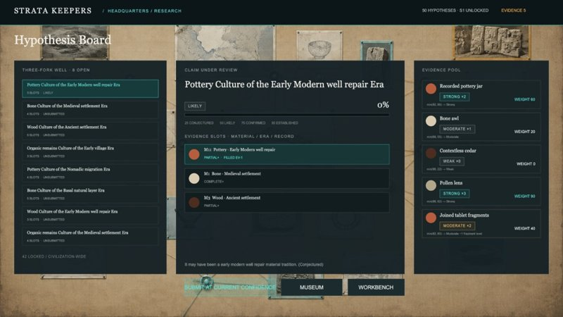<br><sub>Strata Keepers</sub></td>
</tr>
<tr>
<td align="center" rowspan="2"><b><i>Small</i></b></td>
<td align="center">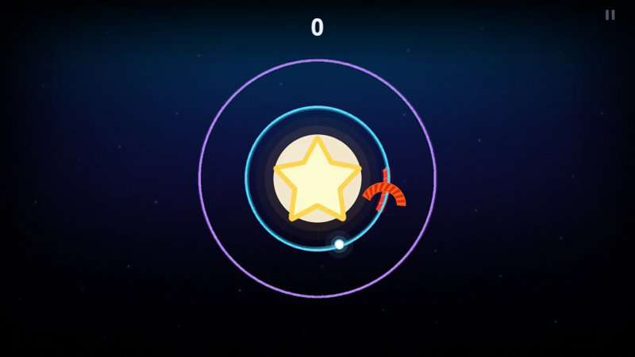<br><sub>Orbit</sub></td>
<td align="center">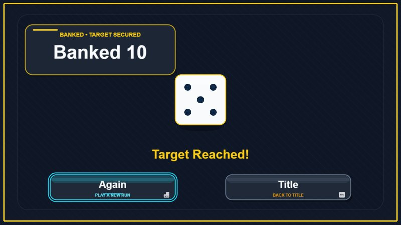<br><sub>Greedy Die</sub></td>
<td align="center">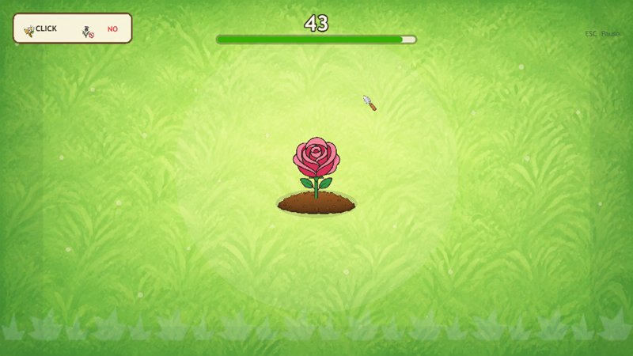<br><sub>Bloom or Weed</sub></td>
<td align="center">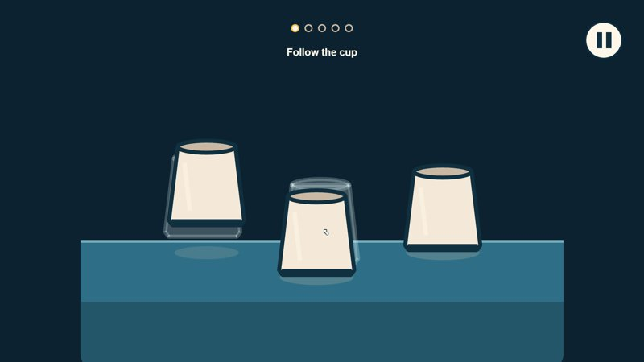<br><sub>Key Under Cups</sub></td>
</tr>
<tr>
<td align="center">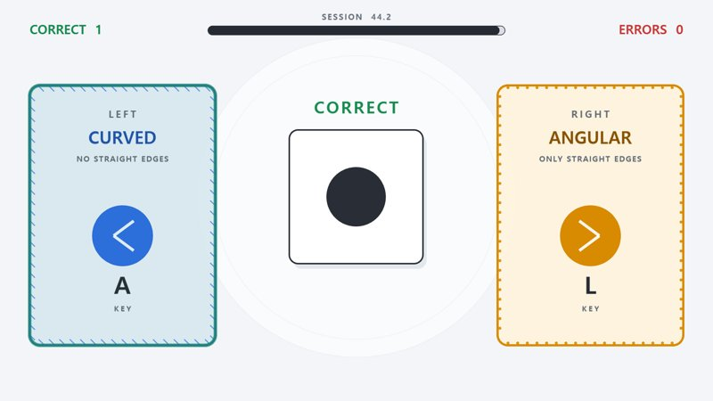<br><sub>Bin Bit</sub></td>
<td align="center">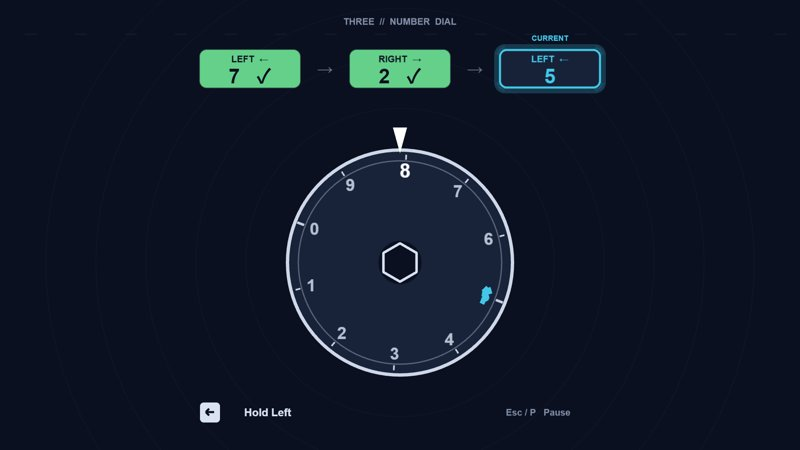<br><sub>Safe Dial</sub></td>
<td align="center">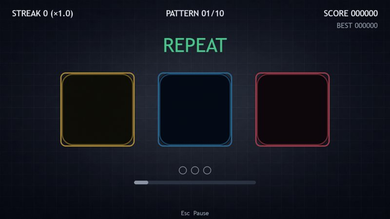<br><sub>Echo Three</sub></td>
<td align="center">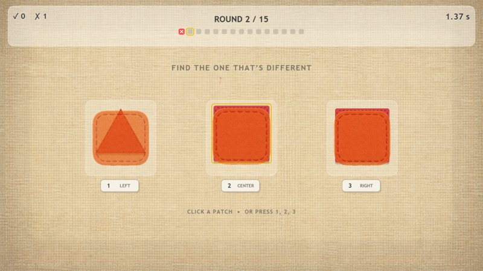<br><sub>Odd Patch</sub></td>
</tr>
</table>
<sub>Games built by the evaluated agents from the <i>Big</i> and <i>Small</i> GDDs.</sub>
</div>


## How It Works

```
GDD ──► Dependency-Aware Contract (fixed for evaluation)
 │
 ▼
coding agent implements the GDD in a shared Phaser starter project
 │
 ├── source-code inspection   is each rule / invariant implemented?   → F_src
 ├── scenario-based replay    does the behavior render on screen?     → F_replay
 └── adaptive playtest        does it happen when the game is played? → F_adapt
```

The resulting judgments and evidence provide requirement-level feedback for iterative revision. All revised builds are evaluated against the same fixed contracts on all three axes.

## Scope

The main benchmark targets 2D single-player browser games in Phaser, providing a common development and execution environment across agents.

## Citation

If you find A2Z GameSpec-Bench useful, please cite the paper:

```bibtex
@misc{lee2026a2zgamespecbench,
  title = {{A2Z GameSpec-Bench}: How Faithfully Can Coding Agents Generate Games from Game Design Specifications?},
  author = {Lee, Seonho and Jeong, Wonryeol and Cereser, Alberto and Kang, Inha and Kim, Hyeonjong and Kwak, Seungmin and Park, Dongmin},
  year = {2026},
  eprint = {2609.39564},
  archivePrefix = {arXiv},
  primaryClass = {cs.AI},
  url = {https://arxiv.org/abs/2609.39564}
}
```

## Acknowledgments

Our scenario-based replay evaluation uses the judge interface and model-provider implementations from [GameCraft-Bench](https://github.com/FreedomIntelligence/gamecraft-bench), released under the [Apache License 2.0](https://github.com/FreedomIntelligence/gamecraft-bench/blob/main/LICENSE).

## License

Copyright © 2026 KRAFTON, Inc. All rights reserved.

Unless otherwise noted, the original code, GDDs, and contracts in this repository are released under the [MIT License](LICENSE). Third-party software and assets retain their respective licenses and attribution notices.
